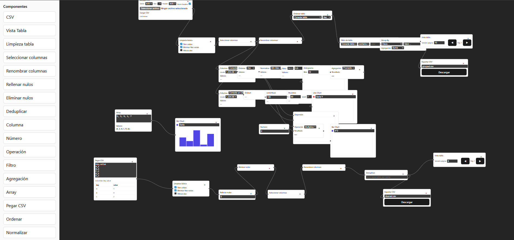

# React Flow Diagram — Transform and visualize CSV data

Visual (no-code/low-code) editor built with React and @xyflow/react to design data transformation flows and visualize results from CSV files. Drag nodes onto the canvas, connect them, and see results propagate automatically.





## Requirements
- Node.js 18+ (20 LTS recommended)
- npm 9+


## Installation & scripts
1. Install dependencies:
   ```bash
   npm install
   ```
2. Development server:
   ```bash
   npm run dev
   ```
   Open the URL shown by Vite (by default `http://localhost:5173`).
3. Production build:
   ```bash
   npm run build
   ```
4. Preview the build:
   ```bash
   npm run preview
   ```
5. Lint:
   ```bash
   npm run lint
   ```


## Quick start
1. From the left sidebar, drag an input node, for example:
   - `CSV` to load a CSV file (drag-and-drop a `.csv` onto the node or use the file picker).
   - `Paste CSV` to paste raw CSV text.
2. Connect the `CSV` node’s right output handle `table` to the `in` input handle of table nodes, e.g.:
   - `Clean Table` → `Select Columns` → `Rename Columns` → `Table Sort` → `Table Filter` → `Group By`.
3. Visualize results:
   - `Table View` to inspect rows/columns.
   - `Bar Chart`, `Line Chart`, `Histogram`, `Scatter` for numeric series.
4. Export results with `Export CSV` (supports both tables and numeric arrays depending on the input).

Tips:
- The `Column` node extracts a numeric series from a connected table via its `csv` input. Use it to feed series nodes (e.g., `Sort`, `Normalize`, `Filter`, `Aggregate`, charts, etc.).
- Some nodes have multiple named inputs (e.g., `Operation` uses `a` and `b`; `Scatter` uses `x` and `y`). Connect each source to the correct handle.
- In `CSV` you can tweak delimiter, decimal separator, and whether the file has headers; auto-detection is enabled by default.


## Node types (by category)
- Input
  - `CSV`: load a CSV file with parsing options and preview.
  - `Paste CSV`: turn pasted CSV text into a table.
  - `Number`: scalar value.
  - `Array`: initial list of numbers.
  - `Column`: pick a column from a table and output a numeric series.

- Table transformation
  - `Clean Table`: trim, drop empty rows, optional lowercase.
  - `Select Columns`: keep a subset of columns.
  - `Rename Columns`: map column names.
  - `Fill Null`: fill empty values.
  - `Drop Null`: discard rows containing empty cells.
  - `Deduplicate`: remove duplicate rows by keys.
  - `Table Sort`: sort by a column (asc/desc).
  - `Table Filter`: filter by column (numeric and text contains).
  - `Group By`: aggregate by key/value (sum, avg, min, max, count).

- Series / values
  - `Filter`: filter a numeric series by comparison (> >= < <= == !=).
  - `Aggregate`: apply sum, avg, min, max, count over a series.
  - `Sort`: sort a series asc/desc.
  - `Normalize`: min-max or z-score.
  - `Distinct`: unique values of a series.
  - `Limit`: first N elements.
  - `Sample`: reproducible random sample (with seed).
  - `Operation`: combine `a` and `b` using + - * / (with broadcasting when applicable).

- Visualization & output
  - `Table View`: preview a connected table.
  - `Bar Chart`, `Line Chart`, `Histogram`, `Scatter`: series charts.
  - `Export CSV`: download a table or a series as `.csv`.


## CSV and locales
- Delimiter: automatic detection among `, ; tab |` or manual selection.
- Headers: automatic detection; normalization supported (lowercase/underscored).
- Decimal separator: `.` or `,` (affects numeric inference).


## Brief architecture
- UI: React 19 + Vite + `@xyflow/react`.
- Reactive evaluation engine: `src/utils/evaluate.js` (propagates results node-to-node based on connections).
- CSV parsing: `src/utils/csv.js` (delimiter/header detection, normalization, basic typing).
- Node components: `src/nodes/*` (each node defines its inputs/outputs and controls).
- Drag & drop sidebar: `src/components/Sidebar.jsx`.
- App entry points: `src/App.jsx`, `src/main.jsx`.


## Examples
- You can start with the `data.csv` file (at the project root) by dragging it onto the `CSV` node.


## Contributing
Improvements are welcome! Open an issue or PR with a clear description and, if relevant, a screenshot/clip of the expected behavior.
